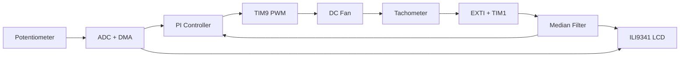
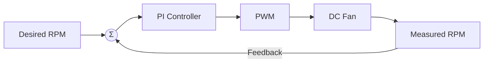

# P1 – Closed-Loop Fan Speed Controller

> A closed-loop DC fan speed controller implemented on the STM32F429 Discovery platform using hardware timers, ADC + DMA, EXTI interrupts and a discrete PI controller.

---
## Demo
https://github.com/user-attachments/assets/582b8df8-908f-4412-a9df-2af458d21a29

## Project Overview

This project implements a complete embedded closed-loop control system for a PWM-controlled DC fan.

The desired fan speed is selected using a potentiometer, while the actual speed is continuously measured from the fan's tachometer output. A discrete PI controller periodically compares both values and adjusts the PWM duty cycle until the measured speed converges to the requested speed.

Unlike a simple open-loop PWM controller, this project automatically compensates for disturbances such as supply voltage variations or changing mechanical load, keeping the fan speed close to the desired setpoint.

The LCD displays the target speed, measured speed and graphical bar graphs in real time.

---

# Features

- Closed-loop PI speed controller
- Hardware PWM generation
- Tachometer-based RPM measurement
- EXTI interrupt processing
- Hardware timer based time measurement
- ADC acquisition using DMA
- Circular DMA buffer
- Median filtering of tachometer measurements
- Real-time LCD visualization
- Modular driver architecture

---

# System Architecture

The firmware is organized into independent modules responsible for acquisition, control and visualization.



---

# Closed-Loop Control

The control algorithm follows the classical feedback control structure used in industrial automation.



At every control period the controller computes the speed error

```
error = desired RPM − measured RPM
```

and updates the PWM duty cycle until the error approaches zero.

---

# Control Algorithm

A discrete PI controller is executed periodically every **100 ms**.

```text
u(k) = Kp · e(k) + Ki · Ta · Σe(k)
```

where

| Symbol | Description |
|---------|-------------|
| e(k) | Speed error |
| Kp | Proportional gain |
| Ki | Integral gain |
| Ta | Controller sampling period |
| u(k) | PWM duty cycle |

The proportional term reacts immediately to the current error while the integral term removes the remaining steady-state error.

The controller period **Ta** is fixed and generated by a hardware timer, ensuring deterministic execution independent of the tachometer frequency.

---

# Hardware

| Component | Purpose |
|------------|----------|
| STM32F429 Discovery | Main microcontroller |
| Waveshare Open429Z | Expansion board |
| Analog Test Board | Potentiometer input |
| PWM DC Fan | Controlled plant |
| Fan Tachometer | Speed feedback |
| ILI9341 TFT Display | Visualization |

---

# Firmware Implementation

## PWM Generation

TIM9 generates a 25 kHz PWM signal that drives the fan.

The controller only updates the compare register while the timer continuously generates the PWM waveform in hardware.

---

## RPM Measurement

Every rising edge of the tachometer signal generates an EXTI interrupt.

A second timer measures the time between two consecutive pulses.

The measured period is converted into RPM.

---

## ADC Acquisition

The desired fan speed is selected with a potentiometer.

ADC1 continuously samples the potentiometer using DMA in circular mode.

This completely removes the CPU from the acquisition path.

---

## Noise Filtering

Raw tachometer measurements contain occasional glitches.

A median filter removes these outliers before the controller receives the measured RPM.

This considerably improves controller stability.

---

## PI Controller

Every 100 ms

1. Read desired speed
2. Read filtered RPM
3. Compute control error
4. Execute PI algorithm
5. Update PWM duty cycle

---

## LCD Visualization

The LCD displays

- Desired RPM
- Measured RPM
- Desired speed bar graph
- Actual speed bar graph

allowing the control loop to be observed in real time.

---

# Results

| Parameter | Value |
|------------|--------|
| PWM Frequency | 25 kHz |
| Controller Period | 100 ms |
| Maximum Speed | ~4000 RPM |
| Feedback Source | Tachometer |
| ADC Mode | DMA Circular |
| Filtering | Median Filter |

After tuning, the controller reaches the requested speed within approximately **300–500 ms** without sustained oscillation.

---

# Project Structure

```
P1_Fan_Control/
│
├── Core/
├── modules/
│   ├── P1_Fan/
│   ├── potis_DMA/
│   ├── median/
│   ├── my_lcd/
│   └── lcd/
│
├── docs/
└── README.md
```

---

# Lessons Learned

This project combines several embedded systems concepts into a single real-world application:

- Timer configuration
- PWM generation
- EXTI interrupts
- ADC with DMA
- Circular buffers
- Signal filtering
- PI control theory
- Real-time visualization
- Embedded debugging

---

# Future Improvements

Possible future extensions include

- Anti-windup for the integral term
- Full PID controller
- Automatic controller tuning
- UART telemetry
- Data logging
- FreeRTOS-based implementation
- Temperature-dependent fan control
