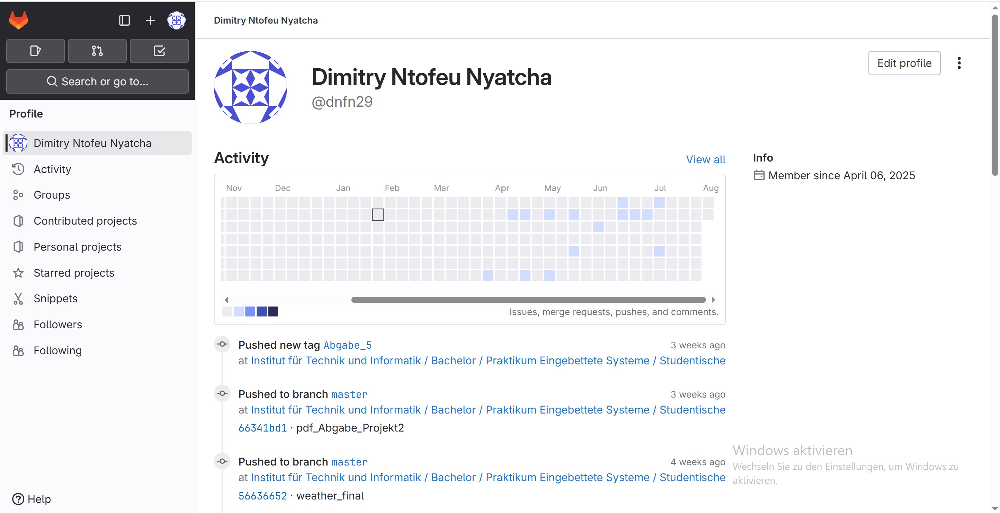

# ⏱️ Stopwatch – Embedded Systems Development (ESD)

Dieses Projekt ist im Rahmen des Kurses **Embedded Systems Development (ESD)** entstanden.  
Ziel war es, **Timer** und **NVIC (Nested Vector Interrupt Controller)** des STM32-Mikrocontrollers zu konfigurieren und eine präzise **Stoppuhr** mit LCD-Anzeige zu implementieren.

---

## 📂 Inhalte des Projekts

Das Repository enthält das CubeIDE-Projekt:

- **08_Stopwatch** – Stoppuhr-Implementierung  und Anzeige der Rundenzeiten auf LCD

Zusätzlich enthält das Repository:

- 📄 `abgabe3.pdf` Theoretische Fragen und `PES_Abgabe_Projekt2.pdf` Antworten zu Timer & NVIC  

---

## ✅ Praktische Aufgaben

### 🔹 Timer-Konfiguration
- Verwendung von **Timer 1** mit Prescaler-Einstellung für 10 kHz Zähltakt  
- Erzeugung eines Überlaufsignals alle 1 Sekunde  
- Nutzung von `__HAL_TIM_GET_COUNTER` zur Echtzeit-Abfrage des Zählers  
- Umstellung auf **Timer 2** und Beobachtung des unterschiedlichen Verhaltens

### 🔹 Stoppuhr-Funktion
- Start, Stop und Reset über **User-Button**   
- Hohe Zeitauflösung: **1/10.000 Sekunde**  
- Rundenzeiten werden berechnet und auf dem LCD dargestellt  
- Implementiert mit **Output-Compare** und Interrupts, um die CPU zu entlasten  

### 🔹 LCD-Anzeige
- Echtzeit-Darstellung von Minuten, Sekunden und Millisekunden  
- Automatische Aktualisierung ohne Blockieren der Hauptschleife  

### 🔹 Erweiterte Interruptsteuerung
- Erklärung und Nutzung von `USE_HAL_TIM_REGISTER_CALLBACKS`  
- Konfiguration verschiedener Signalflanken für EXTI  
- Separates Modul `stm32f4xx_hal_exti` für flexible EXTI-Konfiguration  
- Vergleich von **Interrupt vs. Event** und deren Auswirkungen  

---

## 📄 Aufgabenstellung

Die vollständige Aufgabenbeschreibung befindet sich in der Datei:

📎 `abgabe3.pdf`

---

## ⚙️ Kompilieren & Ausführen

1. Projekt mit **STM32CubeIDE** importieren  
2. Zielboard auswählen (z. B. Discovery Board)  
3. Build starten und Firmware auf die Hardware flashen  
4. LCD und Button anschließen → Stoppuhr testen  

---

## 🧑‍💻 Autor

- Student: DIMITRY NTOFEU NYATCHA
- Kurs: PES 
- Sprache: **C**  
- Tools: **STM32CubeIDE**, **HAL-Driver**

---

## 🔒 Lizenz

Privates Uni-Projekt – kein öffentlicher Wiedergebrauch ohne Rücksprache.  
Nur zu Demonstrations- und Lernzwecken gedacht

---

📎 **Hinweis:** Wenn Sie an den Projekten **Lüfterregelung** und **Wetterstation** interessiert sind,  
finden Sie diese ebenfalls auf meiner [GitLab-Seite](https://git.thm.de/institut-f-r-technik-und-informatik/master-masterseminar/praktikum-eingebettete-systeme/studentischer-code/SoSe-25/) – inklusive Quellcode und Dokumentation. 

## 📂 Inhalte

### 🔹 Lüfterregelung (Fan Control)

🛠 **Ziel:** Drehzahlregelung eines Lüfters mit STM32 und PI-Regler.  
Ein per Potentiometer einstellbarer Sollwert wird durch PWM gesteuert. Die tatsächliche Drehzahl wird über Tachosignale gemessen, geglättet (Median-Filter) und am GLCD angezeigt.

**Highlights:**
- PWM-Erzeugung über Timer  
- Tachosignal-Auswertung mit EXTI & Timer  
- Drehzahlanzeige auf GLCD  
- PI-Regler: Simulation (Matlab/Octave) & Embedded-Implementierung

---

### 🔹 Wetterstation

🌦️ **Ziel:** Wetterdaten erfassen (Temperatur, Luftdruck, Luftfeuchtigkeit) und über CAN-Bus senden.  
Jeder STM32-Knoten veröffentlicht eigene Messwerte im Sekundentakt, empfängt Daten anderer Gruppen und zeigt sie auf dem LCD an.

**Highlights:**
- I2C-Anbindung des BME280 (via Bosch-Bibliothek)  
- CAN-Kommunikation mit ID-Struktur & Filterbänken  
- LCD-Anzeige aller Knoten mit Umschaltung per Joystick

---

## ✅ Lerninhalte & Ergebnisse

- Umgang mit **PWM, EXTI, Timern** und **GLCD-Ausgabe**  
- Anwendung und Optimierung eines **PI-Reglers** (Theorie & Praxis)  
- Sensor-Kommunikation über **I2C** (BME280 + Bosch-Bibliothek)  
- Verständnis des **CAN-Protokolls** (Identifier, Filter, Priorisierung)  
- Entwicklung modularer Embedded-Software (Sensor- & Regler-Module)  
- Echtzeit-**Visualisierung** auf Embedded-Systemen mit Benutzerinteraktion

---
