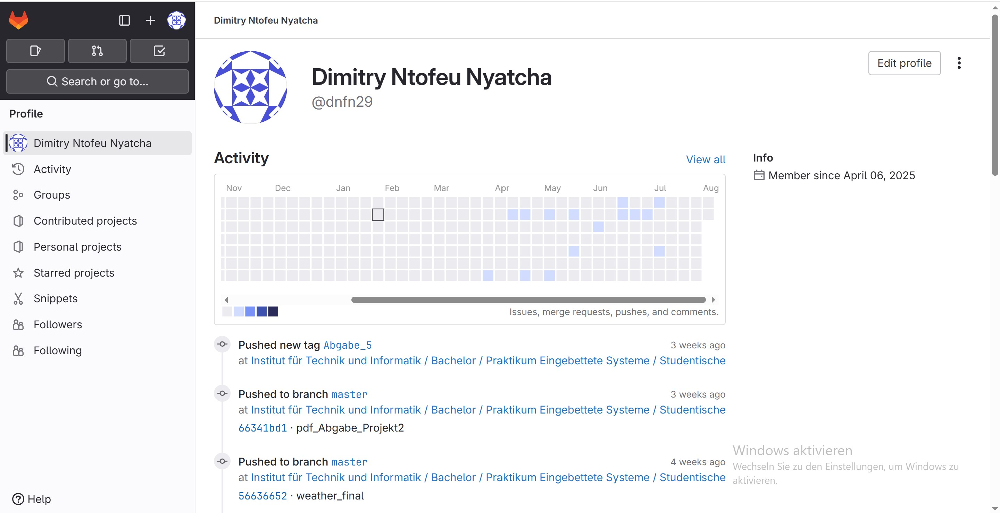

Stopwatch – Embedded Systems mit STM32

Dieses Projekt demonstriert die Konfiguration von **Timern** und des **NVIC (Nested Vector Interrupt Controller)** auf einem STM32-Mikrocontroller.  
Umgesetzt wurde eine präzise **Stoppuhr mit LCD-Anzeige**, ergänzt durch Interrupt-gesteuerte Bedienung.

---

## Projektübersicht

- **08_Stopwatch** – Implementierung einer Stoppuhr mit Rundenzeit-Anzeige auf LCD  
- Dokumentation: `abgabe3.pdf`, `PES_Abgabe_Projekt2.pdf` (Fragen & Antworten zu Timer und NVIC)  

---

## Technische Umsetzung

### Timer & Interrupts
- Konfiguration von **Timer 1** mit Prescaler für 10 kHz Zähltakt  
- Erzeugung eines Überlaufsignals alle 1 s  
- Echtzeit-Abfrage über `__HAL_TIM_GET_COUNTER`  
- Vergleich von **Timer 1** und **Timer 2** zur Analyse des Verhaltens  
- Nutzung von Output-Compare und Interrupts zur CPU-Entlastung  

### Stoppuhr-Funktionalität
- Start, Stopp und Reset über User-Button  
- Zeitauflösung: **1/10.000 Sekunde**  
- Berechnung und Anzeige von Rundenzeiten  
- Aktualisierung ohne Blockierung der Main-Loop  

### LCD-Integration
- Darstellung von Minuten, Sekunden und Millisekunden in Echtzeit  
- Automatische Refresh-Logik  

### Erweiterte NVIC-/EXTI-Steuerung
- Einsatz von `USE_HAL_TIM_REGISTER_CALLBACKS`  
- Flexible Konfiguration der Signalflanken mit `stm32f4xx_hal_exti`  
- Vergleich von Interrupt- und Event-Handling  

---

## Build & Deployment

1. Projekt in **STM32CubeIDE** importieren  
2. Zielboard (z. B. STM32 Discovery) auswählen  
3. Firmware kompilieren und aufspielen  
4. Stoppuhr starten  

---
## Autor

- Student: DIMITRY NTOFEU NYATCHA
- Kurs: PES 
- Sprache: **C**  
- Tools: **STM32CubeIDE**, **HAL-Driver**

---

## Lizenz

Privates Uni-Projekt – kein öffentlicher Wiedergebrauch ohne Rücksprache.  

---

# **Hinweis:** Wenn Sie an den Projekten **Lüfterregelung** und **Wetterstation** interessiert sind,  
finden Sie diese ebenfalls auf meiner [GitLab-Seite](https://git.thm.de/institut-f-r-technik-und-informatik/master-masterseminar/praktikum-eingebettete-systeme/studentischer-code/SoSe-25/) – inklusive Quellcode und Dokumentation. 

## Inhalte

### Lüfterregelung (Fan Control)

**Beschreibung:**  
Implementierung einer geschlossenen Drehzahlregelung für einen Lüfter auf Basis eines **STM32-Mikrocontrollers**.  
Der Sollwert wird über ein Potentiometer vorgegeben, die Ansteuerung erfolgt mittels **PWM**.  
Die Ist-Drehzahl wird über ein Tachosignal erfasst, durch einen **Median-Filter** geglättet und auf einem **LCD** ausgegeben.  
Die Regelung erfolgt über einen **PI-Regler**, dessen Verhalten sowohl in Matlab/Octave simuliert als auch auf der Hardware implementiert wurde.

**Technische Schwerpunkte:**
- PWM-Erzeugung über Timer-Peripherie  
- Tachosignal-Auswertung mit **EXTI** und Timer  
- Echtzeit-Drehzahlanzeige auf LCD  
- PI-Regler: Simulation & Embedded-Implementierung  

---

### Wetterstation

**Beschreibung:**  
Entwicklung einer verteilten Wetterstation mit mehreren STM32-Knoten, die Umweltdaten erfassen und über den **CAN-Bus** austauschen.  
Jeder Knoten misst Temperatur, Luftdruck und Luftfeuchtigkeit, publiziert die Daten im Sekundentakt und empfängt die Werte anderer Knoten.  
Die Messwerte werden auf einem **LCD** dargestellt, die Anzeige kann per Joystick gesteuert werden.

**Technische Schwerpunkte:**
- **I2C**-Anbindung des Sensors **BME280** (Bosch-Bibliothek)  
- CAN-Kommunikation mit strukturierter Identifier- und Filterlogik  
- LCD-Visualisierung aller Knoten mit Umschaltfunktion über Joystick  
- Synchronisation und Echtzeit-Datenaustausch im Embedded-Netzwerk  

---

## Lerninhalte & Ergebnisse

- Umgang mit **PWM, EXTI, Timern** und **LCD-Ausgabe**  
- Anwendung und Optimierung eines **PI-Reglers** (Theorie & Praxis)  
- Sensor-Kommunikation über **I2C** (BME280 + Bosch-Bibliothek)  
- Verständnis des **CAN-Protokolls** (Identifier, Filter, Priorisierung)  
- Entwicklung modularer Embedded-Software (Sensor- & Regler-Module)  
- Echtzeit-**Visualisierung** auf Embedded-Systemen mit Benutzerinteraktion

---
