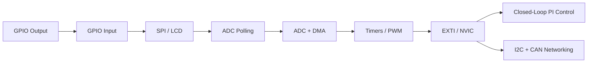

# STM32F429 Embedded Systems Lab

  -orange) 

A progressive series of bare-metal / HAL-based firmware exercises and two complete embedded applications, built on the **STM32F429** (Cortex-M4F, Waveshare Open429Z-D board). It starts at raw GPIO register control and ends at a closed-loop PI motor controller and a multi-node CAN sensor network — each step reusing and extending the drivers built in the previous one.

## Highlights

- 10 standalone exercises + 2 complete applications, each building on the drivers of the one before it
- Drivers written once in [`/modules`](modules), reused across every project — no per-project duplication
- A discrete PI fan-speed controller, gains tuned against a MATLAB/Octave simulation before being carried to hardware
- A multi-node CAN network with per-sensor-type receive filtering
- [`/docs`](docs) covers the *reasoning* behind the harder choices (clock math, filter arithmetic, gain tuning), not just the API

## Table of contents

- [Learning path](#learning-path)
- [Repository structure](#repository-structure)
- [Modules](#modules)
- [Final projects](#final-projects)
- [Technologies covered](#technologies-covered)
- [Hardware](#hardware)
- [Documentation](#documentation)
- [Building](#building)
- [License](#license)

## Learning path


```mermaid
flowchart LR
    A[GPIO Output] --> B[GPIO Input]
    B --> C[SPI / LCD]
    C --> D[ADC Polling]
    D --> E[ADC + DMA]
    E --> F[Timers / PWM]
    F --> G[EXTI / NVIC]
    G --> H[Closed-Loop PI Control]
    G --> I[I2C + CAN Networking]
```

Each stage builds directly on the concepts — and usually the modules — of the one before it:

| # | Project | Concept introduced | Modules used |
|---|---|---|---|
| [`00_Introduction`](00_Introduction) | Toolchain & debugger | CMSIS/HAL project structure, breakpoints/watchpoints, register & variable inspection, raw register vs. `HAL_GPIO_TogglePin` output | — |
| [`01_ESD`](01_ESD) | GPIO output at scale | Driving 13 GPIO lines to multiplex a 4-digit 7-segment display | [`esd`](modules/esd) |
| [`02_Joystick`](02_Joystick) | GPIO input | Digital input with pull-ups, mechanical switch bounce | [`joystick`](modules/joystick), [`esd`](modules/esd) |
| [`03_LCD`](03_LCD) | SPI display | ILI9341 driver, text rendering, pixel primitives, bar graphs | [`lcd`](modules/lcd), [`my_lcd`](modules/my_lcd) |
| [`04_Potis`](04_Potis) | ADC (polling) | Single-conversion analog reads, why analog pins need no pull resistor | [`potis`](modules/potis) |
| [`05_Potis_DMA`](05_Potis_DMA) | ADC + DMA | Circular DMA sampling, ring-buffer averaging to remove ADC noise | [`potis_dma`](modules/potis_dma) |
| [`06_Blinky_Dot`](06_Blinky_Dot) | Timer Output Compare | Hardware-driven PWM blink, zero CPU polling | [`dot`](modules/dot) |
| [`07_Dimming_Dot`](07_Dimming_Dot) | PWM duty cycle | Perceived-brightness dimming via duty-cycle sweep | [`dot`](modules/dot) |
| [`08_Stopwatch`](08_Stopwatch) | Timers + EXTI/NVIC | 1/10 000 s lap timer, interrupt-driven button input | [`dot`](modules/dot) |
| [`P1_Fan_Control`](P1_Fan_Control) | Closed-loop control | EXTI-based tacho measurement, median filtering, discrete PI regulator tuned against a MATLAB/Octave simulation | [`potis_dma`](modules/potis_dma), [`median`](modules/median), [`P1_Fan`](modules/P1_Fan) |
| [`P2_Weatherstation`](P2_Weatherstation) | I2C + CAN networking | BME280 over I²C, multi-node CAN bus with per-sensor filter banks, joystick-driven dashboard | [`env_sensor`](modules/env_sensor), [`joystick`](modules/joystick), [`lcd`](modules/lcd)/[`my_lcd`](modules/my_lcd) |

## Repository structure

```
.
├── 00_Introduction … 08_Stopwatch   10 standalone STM32CubeIDE projects,
├── P1_Fan_Control                    one per exercise, each importing
├── P2_Weatherstation                 what it needs from /modules
├── modules/          shared, reusable drivers — written once, used everywhere
├── docs/             write-ups on the peripheral concepts behind the code
├── PES_Template       base CubeIDE project template the exercises were branched from
└── README.md
```

Every exercise and both final projects pull their drivers from `/modules` instead of duplicating code per project — a change to `esd` or `potis_dma`, for instance, benefits every project that uses it.

## Modules

Reusable, single-responsibility drivers on top of the STM32Cube HAL. Each has its own `README.md` with the pin mapping, API, and the reasoning behind non-obvious choices.

| Module | Category | Peripheral(s) | What it does |
|---|---|---|---|
| [`esd`](modules/esd) | Display | GPIO | 4-digit 7-segment display driver (13 GPIO lines, multiplexed) |
| [`lcd`](modules/lcd) | Display | SPI | ILI9341 TFT driver + graphics primitives (third-party base, adapted) |
| [`my_lcd`](modules/my_lcd) | Display | — | Bar graph and diagnostic drawing helpers on top of `lcd` |
| [`joystick`](modules/joystick) | Input | GPIO | 5-way joystick input (up/down/left/right/press) |
| [`potis`](modules/potis) | Input | ADC | Polling-mode dual-potentiometer ADC reader |
| [`potis_dma`](modules/potis_dma) | Input | ADC + DMA | Continuous circular-DMA ADC sampling with ring-buffer averaging |
| [`dot`](modules/dot) | Timing | Timer (PWM/OC) | Blink/dim an LED via hardware PWM, plus a stopwatch and a One-Pulse-Mode staircase-light timer — all timer-driven, no CPU polling |
| [`utils`](modules/utils) | Timing | GPIO, Timer | Timer-based blocking delay, atomic port-wide GPIO read/write |
| [`median`](modules/median) | Control | — | Fixed-window median filter for noisy sensor signals |
| [`P1_Fan`](modules/P1_Fan) | Control | PWM, EXTI, Timer | Fan PWM generation, tachometer speed measurement, discrete PI controller |
| [`env_sensor`](modules/env_sensor) | Communication | I2C, CAN | BME280 environmental sensor + CAN bus publish/subscribe |

## Final projects

### P1_Fan_Control

Closed-loop PI speed controller for a PWM/tacho fan; setpoint from a potentiometer, live setpoint-vs-actual bar graph on the LCD. Gains (`Kp = 2.0`, `Ki = 3.8`) tuned first in MATLAB/Octave against a simulated plant, then carried over to hardware. → [`P1_Fan_Control/README.md`](P1_Fan_Control)

### P2_Weatherstation

BME280-based sensor node publishing temperature/pressure/humidity on a 125 kbit/s CAN bus every second, with a joystick-selectable multi-node LCD dashboard and per-sensor-type receive filter banks. → [`P2_Weatherstation/README.md`](P2_Weatherstation)

*(Photos/clips of both running on hardware are on the to-do list — more convincing than markdown alone.)*

## Technologies covered

| Digital | Analog | Communication | Control |
|---|---|---|---|
| GPIO | ADC (polling & DMA) | SPI (TFT display) | Discrete PI control |
| EXTI / NVIC | DMA (circular buffers) | I²C (sensor comms) | Median filtering |
| Timers (OC, PWM, One-Pulse Mode) | Prescaler/period math | CAN bus (multi-node, filter banks, arbitration) | MATLAB/Octave-validated tuning |

## Hardware

| | |
|---|---|
| **MCU** | STM32F429 (Cortex-M4F, FPU, up to 180 MHz) |
| **Board** | Waveshare Open429Z-D (STM32F429 Discovery-class board) |
| **Displays** | ILI9341 TFT (SPI), 4-digit 7-segment |
| **Input** | 5-way joystick, Waveshare Analog Test Board (2× potentiometer) |
| **Communication** | I²C (BME280), CAN transceiver |
| **Actuation / sensing** | PWM fan with tachometer output, BME280 environmental sensor |

## Documentation

[`/docs`](docs) holds the peripheral-level write-ups behind the drivers above — the calculations and trade-offs, not just the API:

- [Clock tree & timers](docs/clock-tree-and-timers.md) — PLL configuration, prescaler/period arithmetic, One-Pulse Mode
- [ADC & DMA](docs/adc-dma.md) — sample timing, DMA request mapping, averaging trade-offs
- [GPIO interrupts & NVIC](docs/gpio-interrupts-nvic.md) — EXTI trigger modes, interrupt vs. event, why EXTI has 23 lines
- [I²C protocol](docs/i2c-protocol.md) — bus arbitration, repeated start, the BME280 integration
- [CAN bus](docs/can-bus.md) — frame structure, arbitration, filter bank math with worked examples

## Building

Each exercise/project folder is a standalone STM32CubeIDE project; `/modules` is shared across all of them as a common source location rather than duplicated per project. To build one:

1. Open STM32CubeIDE, `File → Import → Existing Projects into Workspace`.
2. Import the project folder you want (e.g. `P1_Fan_Control`) **and** `modules`.
3. Build and flash to a Waveshare Open429Z-D (or any STM32F429-based board wired per each module's pin mapping).

## License

MIT — see [LICENSE](LICENSE).
